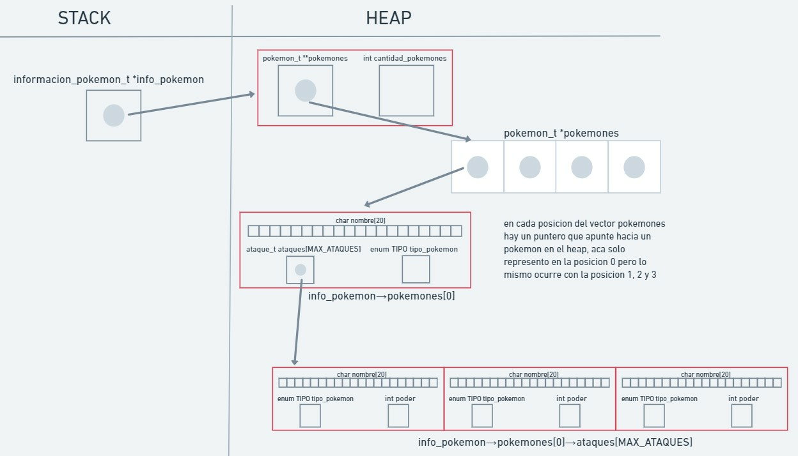

<div align="right">

</div>

# TP1

## Repositorio de Tomás Hevia - 110934 - thevia@fi.uba.ar

- Para compilar:

```bash
gcc -std=c99 -Wall -Wconversion -Wtype-limits -pedantic -Werror -O2 -g src/*.c pruebas_chanutron.o -o pruebas_chanutron
```

- Para ejecutar:

```bash
./pruebas_chanutron
```

- Para ejecutar con valgrind:
```bash
make valgrind-chanutron
```
---

##  Funcionamiento

El codigo de pokemon.c realiza diferentes acciones con el archivo que recibe, lo primero que hace es leer el archivo y, si cumple con el formato pedido en la funcion, guarda los pokemones en la memoria del programa y en otras funciones permite realizar con estos pokemones diferentes acciones.
El archivo debe tener el siguiente formato para que la funcion pokemon_cargar_archivo logre almacenar los pokemones en memoria:
nombre;tipo
ataque1;tipo;poder
ataque2;tipo;poder
ataque3;tipo;poder
nombre;tipo
ataque1;tipo;poder
ataque2;tipo;poder
ataque3;tipo;poder

pokemon.c incluye 3 bibliotecas: ataque.h, pokemon.h y tipo.h

en pokemon.c se usan dos estructuras que son fundamentales para el funcionamiento del programa, estas son pokemon_t e informacion_pokemon_t.
pokemon_t representa a un pokemon, que tiene un nombre, un tipo y 3 ataques.
los ataques estan definidos en ataque.h y se conforman por el nombre, el tipo y el poder.
informacion_pokemon_t contiene un puntero a un vector de pokemones (los pokemones son de tipo pokemon_t) y la cantidad de pokemones. 
a informacion_pokemon_t lo usamos para guardar a los pokemones en la memoria.


Funcion pokemon_cargar_archivo:

esta funcion recibe un string que representa el nombre de un archivo, en la funcion se corrobora que el string no sea nulo y se intenta abrir el archivo, si no se abre la funcion devolvera null y si se abre continuara ejecutandose.

luego se reserva lugar en memoria dinamica para un informacion_pokemon_t que es donde se van a guardar los pokemones, esto se inicializa con calloc (todas las variables en 0). En el caso que el calloc falle, se cierra el archivo y se devuelve null

luego usa un bucle while para ir leyendo el archivo y guardando los datos del mismo, se saldra del bucle cuando alguna linea sea invalida, tenga algun dato invalido, falle alguna asignacion de memoria o si el archivo se termina de leer.

dentro del while se leen y guardan 4 lineas del archivo, la primera de estas lineas representan el nombre y tipo del pokemon y las otras los ataques (nombre;tipo;poder)
se usa un fscanf para leer el archivo y guardar los strings.
si no se leen correctamente, se termina la iteracion, si se leen bien se sigue ejecutando.

luefgo mediante la funcion crear_nuevo_pokemon se crea un pokemon_t.
esta funcion crea un pokemon_t *nuevo_pokemon y le asigna lugar en el heap usando malloc. se chequea que la memoria se haya asignado correctamente.
luego, con sscanf, se leen las lineas guardadas y los datos se asignan en nuevo_pokemon.
se validan que los datos sean de la cantidad correcta (11) y que los tipos del pokemon y los ataques sean validos, si esto no se cumple, se libera la memoria de nuevo_pokemon y se corta la iteracion, si se cumple continua.

luego de crear el nuevo_pokemon, se va a asignar este pokemon al vector info_pokemon->pokemones mediante la funcion asignar_pokemon_a_info_pokemon.
esta funcion lo que hace es asignar memoria en el vector pokemones usando realloc. por cada pokemon que se quiere agregar, realloc aumenta el tamaño del vector. se usa un puntero_auxiliar en caso de que realloc falle, asi no se pierde lo que ya hay dentro del vector pokemones.
luego de asignarle el lugar al vector pokemones, se toma la ultima posicion del vector y con calloc se guarda memoria para el nuevo_pokemon en el heap.
luego en esa direccion de memoria se copia el valor de la direccion de memoria de nuevo_pokemon. quedando asi guardado en info_pokemon->pokemones el nuevo_pokemon.

la funcion itera mientras se lee el archivo y asignan correctamente los pokemones en info_pokemon. cuando algo falla o el archivo termina, se corta la iteracion. lo siguiente que hace la funcion es cerrar el archivo.
luego chequea si info_pokemon->cantidad_pokemones >= 1 (esto chequea que al menos se guardo un pokemon)
si es correcto, devuelve informacion_pokemon_t *info_pokemon (contiene un vector de pokemones y la cantidad de pokemones que hay)
si es false, devuelve null y libera la memoria ocupada por info_pokemon.


despues las demas funciones tienen un funcionamiento mas simple:

pokemon_buscar: busca un pokemon segun su nombre y lo devuelve, si no lo encuentra devuelve null.

pokemon_cantidad: devuelve la cantidad de pokemones que hay en ip

pokemon_nombre: devuelve el nombre del pokemon recibido

pokemon_tipo: devuelve el tipo del pokemon recibido

pokemon_buscar_ataque: busca el ataque en el pokemon segun el nombre que recibe. si lo encuentra lo devuelve y sino devuelve null

con_cada_pokemon: ordena los pokemones y les aplica la funcion que recibe a todos ellos, devuelve la cantidad de pokemones a los que se les aplico la funcion

con_cada_ataque: le aplica la funcion f a todos los ataques del pokemon, devuelve la cantidad de ataques a los que les aplico la funcion.
todas estas funciones chequean que los datos que reciben no sean null, si lo son devuelven null, 0 o NORMAL, segun la funcion.

pokemon_destruir_todo: libera toda la memoria que se usa durante la ejecucion del programa, mediante free()


## Respuestas a las preguntas teóricas

para ordenar los pokemones alfabeticamente, uso el metodo de ordenamiento Burbujeo.
lo que hace este algoritmo es ir comparando los nombres de los pokemones de a pares "empujando" hacia el fondo del vector al pokemon con nombre "mas grande" alfabeticamente. por ejemplo si compara pokemones[0].nombre = "Pikachu" y pokemones[1].nombre = "Charmander" lo que hace es intercambiar de posicion a estos pokemones, luego continua comparando a Pikachu con el pokemon en la posicion 2, luego la 3 y asi continua hasta el final.
cuando termina de comparar, arranca otra vez desde el inicio, esta vez llega a comparar hasta el anteultimo pokemon.
luego arranca devuelta y llega hasta el anteultimo.
asi itera hasta terminar comparando todos los pokemones y quedan ordenados.

El costo computacional es de n².


DIAGRAMA DE MEMORIA:

<div align="center">

</div>